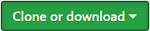

# Neighborhood-Map-V2

I created this Web App as a project submission for the [**Front-End Web Developer Nanodegree**](https://www.udacity.com/course/front-end-web-developer-nanodegree--nd001) I was taking at [**Udacity**](https://www.udacity.com/). 

Below I've included the project outline and reasoning behind this project as given by Udacity.  You can view a more detailed project rubric [**here**](https://review.udacity.com/#!/rubrics/17/view).

## Project Overview
You will develop a single page application featuring a map of your neighborhood or a neighborhood you would like to visit. You will then add functionality to this map including highlighted locations, third-party data about those locations and various ways to browse the content.

## Why this Project?
The neighborhood map application is complex enough and incorporates a variety of data points that it can easily become unwieldy to manage. There are a number of frameworks, libraries and APIs available to make this process more manageable and many employers are looking for specific skills in using these packages.
  

## To run this application &nbsp;&nbsp;&nbsp;&nbsp;&nbsp;&nbsp;&nbsp;&nbsp;&nbsp;&nbsp; [` ^ `](#top "Go to top of page")

1. On the [main repository page](https://github.com/go-0100-it/Neighborhood-Map-V2 "Go to main repository page") click &nbsp;&nbsp; and download the project zip file or you can just click this button &nbsp;&nbsp; to download the zipped files to your computer.

2. Unzip the file.

3. Browse to the docs folder located at   
`Neighborhood-Map-V2-master\Neighborhood-Map-V2-master\docs`   
and locate the `index.html` file.

4. Open `index.html` in the browser of your choice.

### Or you can view the GitHub hosted version of the [**Web App**](https://go-0100-it.github.io/Neighborhood-Map-V2/).
  